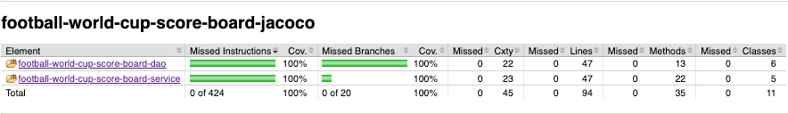
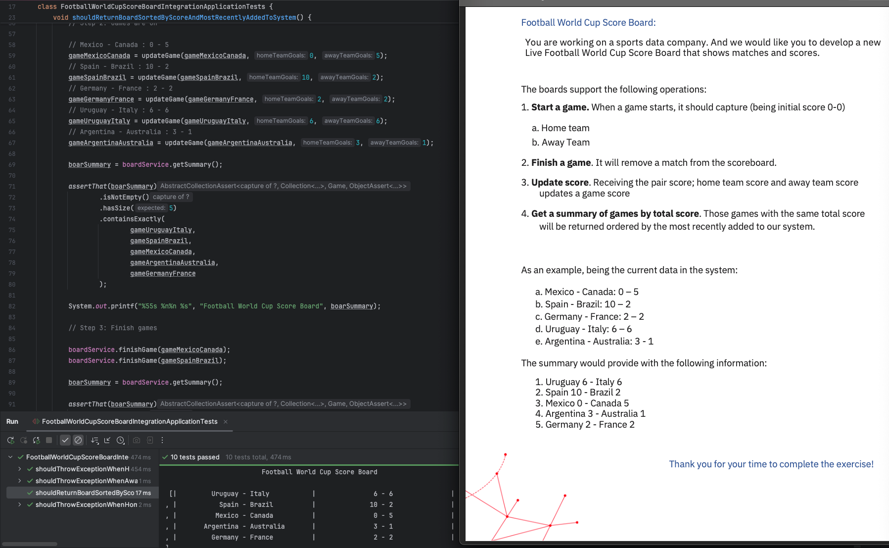

# football-world-cup-score-board

Live Football World Cup Score Board that shows matches and scores.

## Project Structure

- **Java, Spring Boot, Maven** backend

## Getting Started

### Prerequisites

- JDK 21
- Maven

### Run Configuration

Run configurations are provided in the [`.run`](.run) folder for easy setup in supported IDEs.

### Assignment

See the [assignment PDF](assignment/Crawlers%20-%20Coding%20Excercise.pdf) for detailed requirements and specifications.

## Testing

- **Unit tests** are included for all modules.
- **[Integration tests](football-world-cup-score-board-integration/src/test/java/com/pavelshapel/football/world/cup/score/board/integration/FootballWorldCupScoreBoardIntegrationApplicationTests.java)** are provided, including a result verifier to ensure correct end-to-end behavior.

To run all tests with coverage:

```sh
mvn verify
```

## Screenshots




